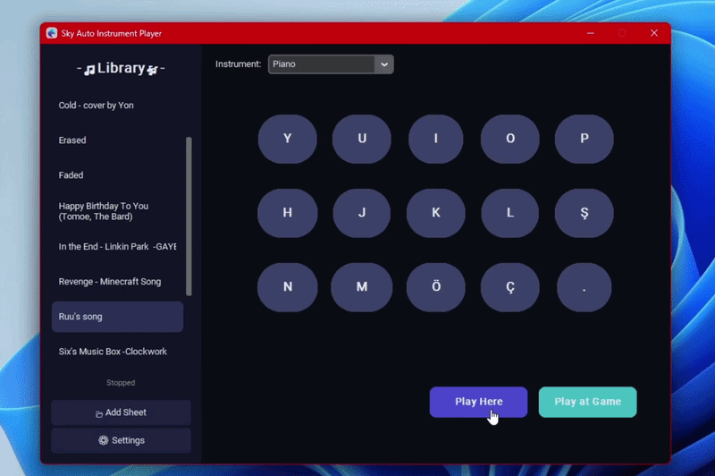

# 🎵 Sky Auto Instrument Player

Play music automatically in **Sky: Children of the Light** using sheet files!

<p align="center">
  
</p>

---

## ✨ Features

- 🎹 15-key Sky Instrument interface
- 🎵 Support for multiple instruments (Piano, Fulute, etc.) 
- ⌨️ Custom keyboard layouts with profile system
- 🔍 Automatic scan code detection
- 📂 Easy sheet file management  
- 🎮 Play in-game or locally  
- 🖥️ Floating overlay showing pressed keys
- 📜 Supports multiple sheet formats  

---

## 📥 Installation

### Option 1: Executable (Easiest)

1. Download `Sky Auto Instrument Player.exe` from the [**Releases**](https://github.com/MERT-CKR/Sky-Instrument-Player/releases/tag/Sky-Auto-Instrument-Player) page  
2. Run the application 
3. Done!


### Option 2: Python (For Developers)

1. Install Python 3.8+  
2. Clone this repository  
3. Install dependencies:

```bash
pip install -r requirements.txt
```

4. Run:

```bash
python main.py
```

---

## 🎮 How to Use

### 🎹 First-Time Setup

1. Create Your Keyboard Profile
    - Go to Settings → Manage Profiles
    - Click "+ New Profile"
    - Press each key on your keyboard when prompted (15 keys total)
    - The app will automatically detect your keyboard layout

2. Select Target Window (for in-game play)
    - Go to Settings → Select Game Window
    - Choose Sky from the list

---


## 🎵 Where to Find Ready-Made Sheet Music
- The app uses the same note system as: [Sky Music Nightly](https://specy.github.io/skyMusic)
You can create music there and play it directly in this app or in-game.

- Discord Channel: [Sky & Genshin Music Nightly](https://discord.ggArsf65YYHq)

- Search in Discord communities for sheets

---

## 📂 Supported Sheet File Extensions

- `.txt`  
- `.json`  
- `.skysheet`
---


## 📥 Adding Sheets

### `.skysheet`
This format is fully supported.  
Simply open the app and click the **Add Sheet** button.


### `.genshinsheet`  
this extension is for genshin and 21-key based so it's unsupported.  
if you already playing `Genshin Impact` you can use them with [Genshin Auto Lyre Player](https://github.com/MERT-CKR/Genshin-AutoLyrePlayer/tree/main)

--- 

## 📁 Managing Sheets

- Press `Win + R`, type `appdata` and go to `\SkyAutoPlayer\sheets`
- The `sheets` folder contains all available music files  
- You can rename or remove them freely  
- If there are no sheets, simply add your own

---

## 📜 License

Apache License Version 2.0

---

## 🙏 Credits

- Made by **Mert Çakır**  
- Uses **CustomTkinter**, **Pygame**, **PyAutoGUI**

---


